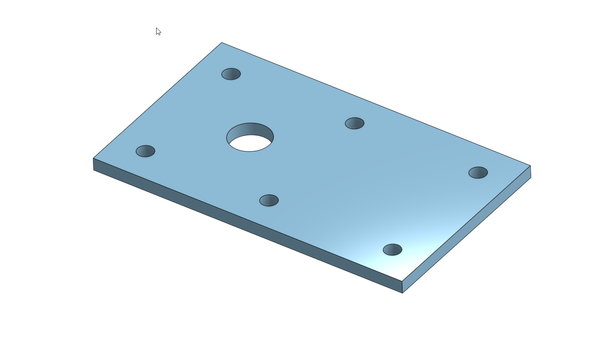
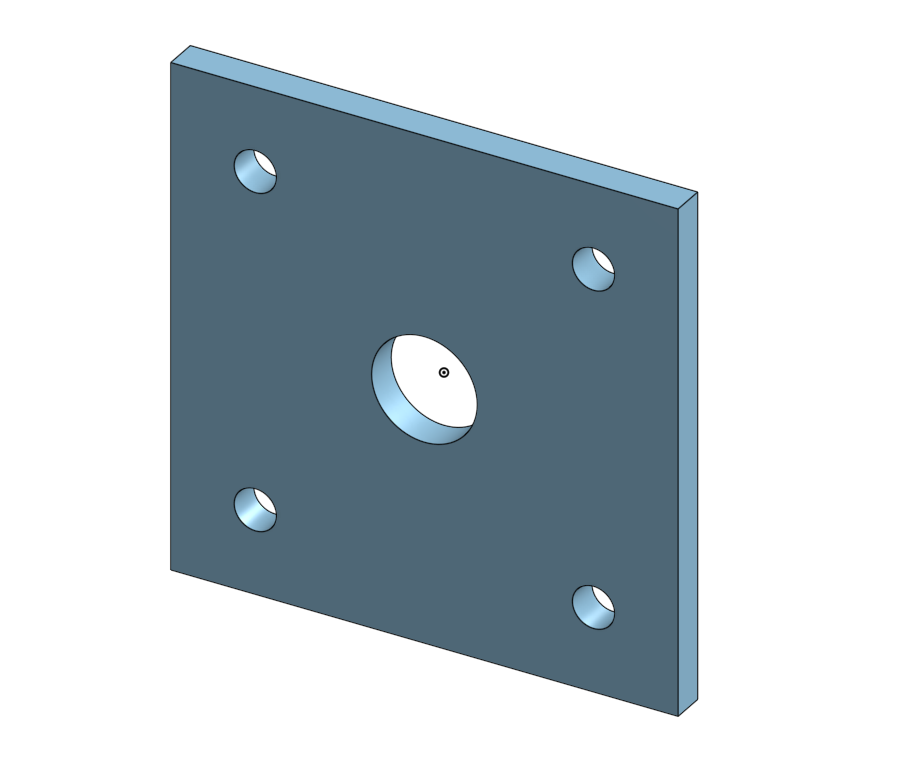
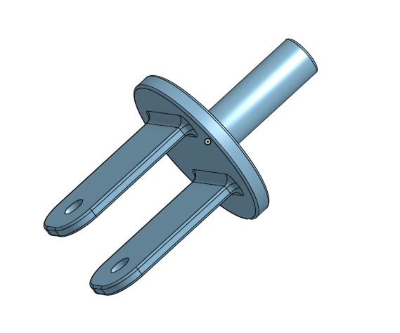
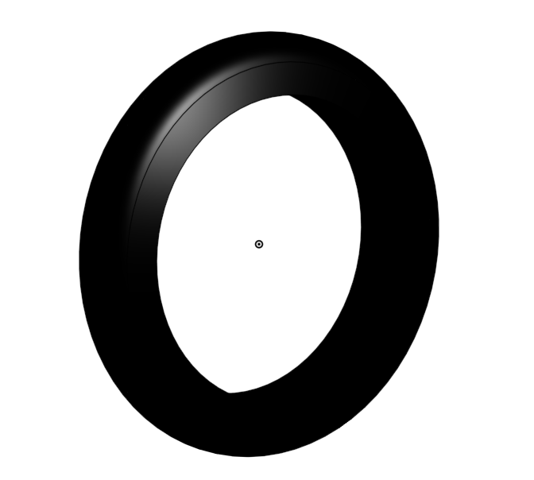
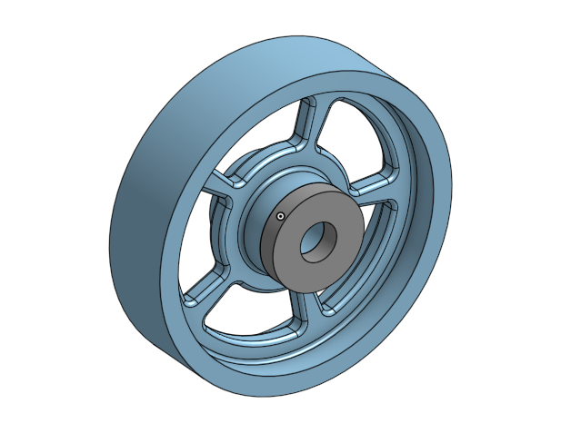
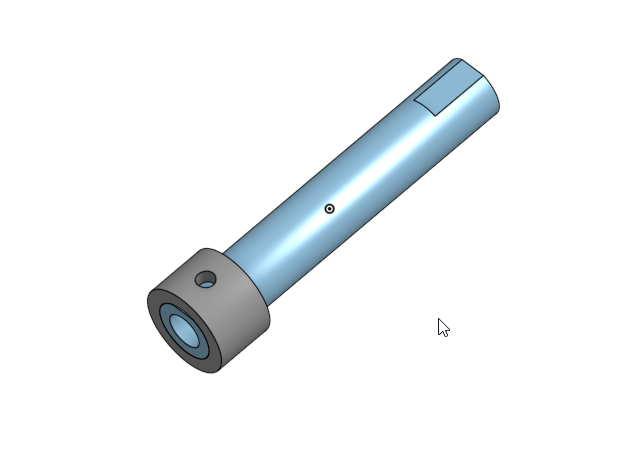
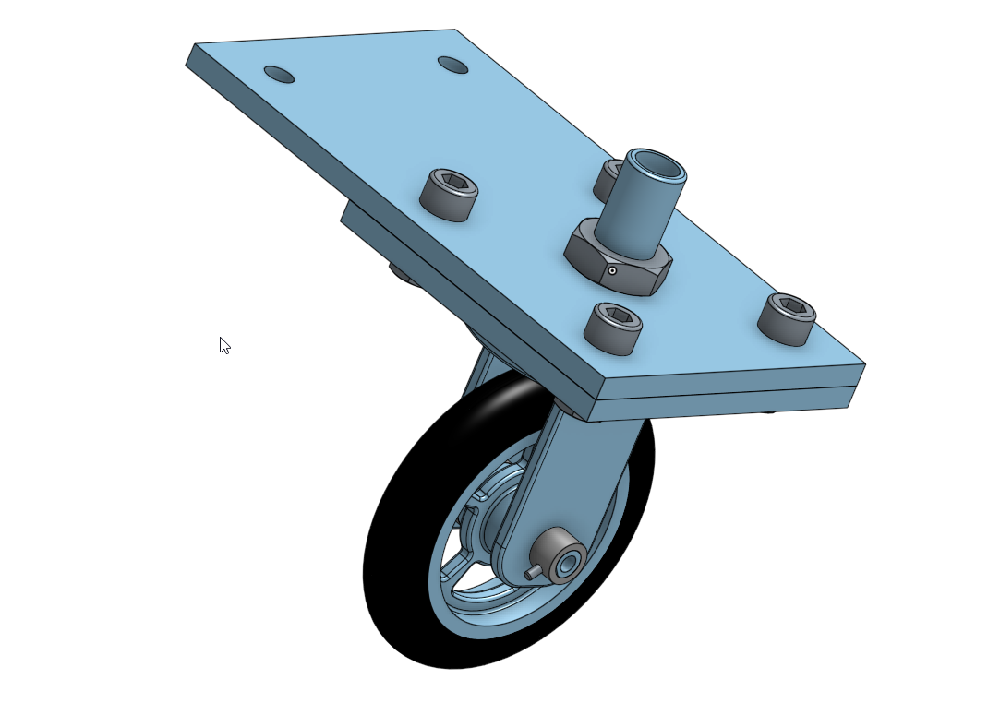

# BasicCAD

## Table of Contents
* [Table of Contents](#Table-of-Contents)
* [Base](#Base)
* [Mount](#Mount)
* [Fork](#Fork)
* [Tire](#Tire)
* [Wheel](#Wheel)
* [AxleCollarBearings](#Axel and Collar)

## Base

This was actually a lot easier than I thought it was. I thought that it would be hard on OnShape due to the change of platform, but i got used to it very quickly.

## Mount

The mount was very easy to make. I didn't use the method that Mr. H explained to me as I thought it was a bit confusing and I didn't want to mess it up. I ended up just making a new part and copying over the dimensions and sketch geometry.

## Fork 

This part was really easy to make. I remembered exactly how to do it from last year, so it only took about 20 minutes. However, when I dimensioned the distances of the rectangles, I used the wrong pieces of the rectangles and I only noticed this when I got to the assembly.

## Tire

This part took less than 5 minutes to make. I remembered the revolve function and it was very simple sketch-wise.

## Wheel

This part was also very simple, as it used the revolve feature. I spent roughly 5 minutes on this part, and all that was challenging was getting the mates and making the shape fully constrained.

## Axel and Collar

This was very simple, as it was basically just two extruded concentric circles.

## Wheel and Axel

Learning how to do the new mates was actually really fun and I learned how to do it extremely fast. I spent probably 15 minutes on it in total.

## Caster

This was overall an extremely fun project and I had a lot of fun remaking all the pieces in Onshape rather than Solidworks. I really enjoyed the different ways that you import standard items and mate things.
