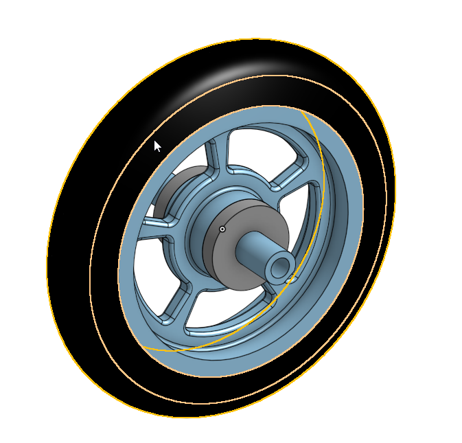

# BasicCAD

---

- I made a [caster](https://cvilleschools.onshape.com/documents/2450def9f817c9f725a31395/w/bd5d2351defea85021d20a5a/e/ca8e8d6df98edfaf2fcfceb1) again, but in a different software. Kind of like going from French to Spanish.

# Table of Contents

### Caster
* [Base](#TableOfContents)
* [Mount](#Base)
* [Fork](#Mount)
* [Tire](#Fork)
* [Wheel](#Tire)
* [AxleCollarBearings](#Wheel)
* [Bearing](#Bearing)
* [Wheel And Axel](#Wheel_And_Axel)
* [Caster](#FinalCaster)
* [Takeaway / Final Thoughts](#Takeaway)

## [Dorothy's Dowel Pins](#DorothyPins)

## [Assemblies Project](#Assemblies)

## [Onshape Collaboration](#Onshape_Collaboration_Project)

---
---
---
---
---
---

# Projects
----

# Caster-
---
# [Base](https://cvilleschools.onshape.com/documents/353adf082fbc792ba13d4462/w/436621e22844ca6637f5b74c/e/b4c8503c4f4c5fa97e5252db)

## ***Description***
This part was a rectangle (200 x 120 mm) that was extruded 8mm, with 6 10mm wide holes spread evenly across the face of the part. There was also a 25mm center hole.
## ***Reflection***
This was actually a lot easier than I thought it was. I thought that it would be hard on OnShape due to the change of platform, but i got used to it very quickly. 

---
# [Mount](https://cvilleschools.onshape.com/documents/46768d04d362090ab351408f/w/5d21ce23e3a017efa8838628/e/8457bd39094742190d14fda0)

## ***Description***

The mount was very easy to make. I didn't use the method that Mr. H explained to me as I thought it was a bit confusing and I didn't want to mess it up. I ended up just making a new part and copying over the dimensions and sketch geometry. It was just a rectangle with holes spaced out evenly across to allow for the base to fully support the fork and wheel in the final product.

---
# [Fork](https://cvilleschools.onshape.com/documents/589f920685521cb794707851/w/2c120b6b5092ad41d9c81965/e/22497d4e152375cd2abb89d0)

## ***Description***

This part was really easy to make. I remembered exactly how to do it from last year, so it only took about 20 minutes. However, when I dimensioned the distances of the rectangles, I used the wrong pieces of the rectangles and I only noticed this when I got to the assembly. I accidentally dimensioned the centerline to the middle of the rectangle rather than the side of it.

---
# [Tire](https://cvilleschools.onshape.com/documents/38021a99b790bc8086a8d479/w/79e3e6747ae8a860df2d6428/e/364541b5f4b31d74922dffb3)

## ***Description***

This part took less than 5 minutes to make. I remembered the revolve function and it was very simple sketch-wise.The part consisted of may small rectangles that we used the "Trim Entities"Tool to make into a single shape. The distancing was very exact, and I ended up accidentally using the wrong leg on one of the rectangles to distance, which took a few minutes of careful retracing of my steps to uncover.

---

# [Wheel](https://cvilleschools.onshape.com/documents/16a0348281fc257c5c3b8d33/w/c7f5b91de47021ddd09ca707/e/e3989c2135b0927816098c76)

## ***Description***

This part was also very simple, as it used the revolve feature. I spent roughly 5 minutes on this part, and all that was challenging was getting the mates and making the shape fully constrained. Also, I had to create a small arc that acted as the top of the trapezoid that was used as the wheel cutout.

---

# [Axel and Collar](https://cvilleschools.onshape.com/documents/73daea957b6c062132ca7f00/w/d8869b87d0efb7d846261d64/e/2dcb009edddb363913bfc083)

***Description***

This was very simple, as it was basically just two extruded concentric circles. However, on the axel part, there was one rather difficult part. We had to create a sketch on the end plane of the axel, and there we created a small rectangle that we removed from the axel. I then mirrored it across the middle of the part.

---
# [Bearing](https://cvilleschools.onshape.com/documents/b252a1dfa20df87376701d0e/w/5fc9867e29fd87ad2aaf4523/e/8b152f7c3da40f0c04645bf2)

***Description***

This was the most simple part of all of the parts I created for the Caster. It was just a thin ring that had an outer diameter of 30mm and an inner diameter of 20mm

---

# [Wheel_and_Axel](https://cvilleschools.onshape.com/documents/851d373919ec8b08767eca46/w/10bab2ed09746d293d2c519a/e/8f4c1beb489d9aea29b5063f)

## ***Description***

Learning how to do the new mates was actually really fun and I learned how to do it extremely fast. I spent probably 15 minutes on it in total. When I was mating the axel with the wheel, however, I did not select the center of the wheel, resulting in a very slight offset of the axel. This was only apparent when I added on the bearings and one side has extra axel and the other was short. I could barely see this when I was looking at the whole assembly, but when I zoomed in really close and used the measure tool, I could see that there was a small offset. I fixed this by deleting the mate and remating the center of the axel to the proper center of the wheel.

---

# [FinalCaster](https://cvilleschools.onshape.com/documents/2450def9f817c9f725a31395/w/bd5d2351defea85021d20a5a/e/ca8e8d6df98edfaf2fcfceb1)

## ***Description***

This was overall an extremely fun project and I had a lot of fun remaking all the pieces in Onshape rather than Solidworks. I really enjoyed the different ways that you import standard items and mate things.

---

# Takeaway

In the end, I learned so much about Onshape. I learned how to use the new mates, how to sketch, extrude, revolve, and almost all the basics of Onshape. I prefer Onshape over Solidworks because it is much more friendly to beginners, and it is much easier to get things done. One thing that I would like to avoid next time is using the wrong parts of a sketch as dimension material. This can be easily avoided by just double checking your work

 # [BACK TO TOP](#BasicCAD)

 
 # [DorothyPins](https://cvilleschools.onshape.com/documents/d2c16952d6642b4a45eb554b/w/4440370332a1807b299e7087/e/acb7cac74f35e6439e6dd6fc)
 
 
 ## Description of Project
  This project was quite easy, as I just had to figure out how to make the dowel rods and use configurations, which was much easier than SolidWorks, and then make the frame, which was just basic math and engineering. The only problem that I had was that I didn't make the frame wide enough many times, so the frame was actually bigger than the picture area.
 
---
 
 # [Assemblies](https://cvilleschools.onshape.com/documents/8e23af001e7c001e0181cd19/w/a23ef92942d0c7291bae280b/e/f76d45acd49338ba1aaa9de3)
 In the week of 1/11/2020, we did an assembly project in OnShape. I didn't learn all that much from this assignment, as we had already used these functions in the assembly for the caster, but it was still good practice for future projects.
 
 
 
 # [BACK TO TOP](#BasicCAD)
 
 
#  [Onshape_Collaboration_Project](https://cvilleschools.onshape.com/documents/138a10bebb31e0d42cb96812/w/07115195b5f2f55e515949ca/e/e84453342b07e8982a5d8853)
  ***Description***
  This was a Collaboration project. We were all put into breakout rooms with a group of people, and the goal was to create an object shown to us, with no dimensions or help provided. I was partnered with Justyn and Nicole, and we delegated out parts to eachother equally. We delegated parts based on relation to eachother. For example, I would not do one half of the plunger while Justyn does the other half, as that makes it very difficult to keep track of things. Therefore, Justyn worked on the Rod and the Bracket, I worked on the chamber and the plunger, and Nicole worked on the Bases and the poles.
  
  
  
  ***Our Take on the Project***
  
 We also had to think about what item we were making, and the practical world uses of it. We thought that this item looked like a vaccuum chamber, but Nicole decided that it was more like a french press than anything. Nonetheless, we decided that it was used to press something together, or to create a seal of some sort.
 
   #### My Part of the Project
   
  For my part of the Project, I had to create the chamber and the plunger. I did this by communicating to my friends that I was going to make the outer diameter of the chamber 56 mm, and the inside of the chamber 50 mm. This would make the outer diameter of the plunger 50mm, with an inner diameter of 48mm. I then had to make an extruded shaft hole for the pole to go into, and I communicated this to Justyn so he would know how wide to make the shaft for our part. In the end, however, Justyn and I had to work together to finish the bases and cut the circles into them ourselves, as Nicole could not figure it out and we decided to have her follow us and watch along. 
  
  
  
  #### Lessons Learned - 
  I learned many things during the course of this project. When I was creating the plunger, I had made it in three parts, with the cylinder being a fourth part. I didn't see anything wrong with this until Mr.H almost had a heart attack looking at all the different parts I had made. I followed him on OnShape with the follow tool, and I watched him add the extrusions to the original one rather than create a new one. This showed me ways that I can streamline the amount of parts I make. ***ALSO I learned that NAMING PARTS*** is one of the most important things that you con do when creating an assembly - It allows for easy access when putting everything into the assembly tab, and it creates for a less hectic work environment.
  
  
  
---
 
 
 
 
 
 
 
 
 
 
 
 
 
